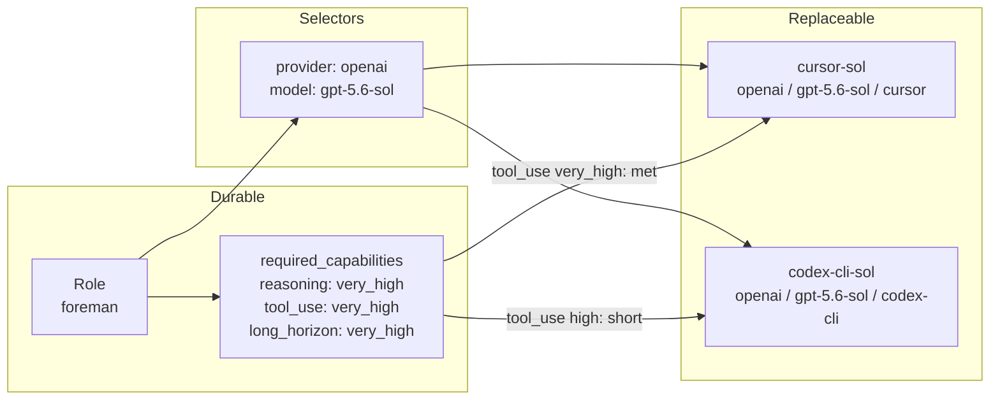
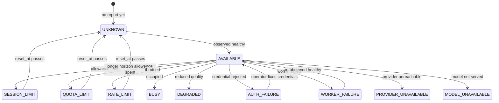
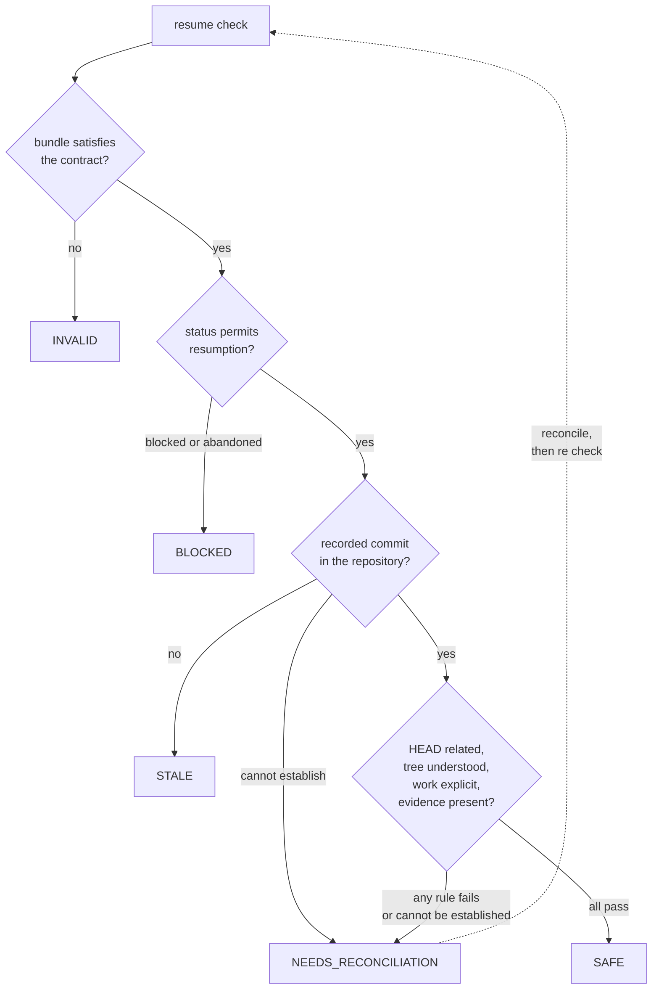

# HowlForge Architecture

## The problem this solves

In HowlFutureWorks, role identity was implicit. Work was routed to whichever
provider happened to be configured, which meant a role was effectively a synonym
for a model. When that model's session ended, the role ended with it and the
work stalled. HowlPlane measured this directly: 231 of 722 campaigns stopped
with `all_providers_exhausted`.

HowlForge separates the durable thing from the disposable thing.

| Durable | Disposable |
| --- | --- |
| Roles: what work exists and what it requires | Runtimes: which model, reached how |
| Capability requirements | Capability declarations |
| The handoff contract | The session that produced a handoff |
| The verification requirement | The worker that satisfied it |

## Role and runtime separation

A role never names a runtime id if it can avoid it. It declares capability
floors and an ordered list of **selectors**:

```yaml
preferred_runtimes:
  - provider: openai
    model: gpt-5.6-sol
```

A selector matches on any combination of `id`, `provider`, `model` and
`runtime`. Fields that are set must match; fields left out are wildcards. So the
selector above means "Sol, wherever it is hosted", and a new client for that
model becomes a candidate with no role edit.

This is the mechanism that makes the core claim true rather than aspirational.
`architect` cannot be equal to `opus`, because `architect` is a set of
requirements and `opus` is one of several things that might satisfy them.

## The four identity levels

Borrowed deliberately from HowlPlane's `documentation/AI_RESOURCE_POOL.md`, so
the two systems describe the same thing with the same words.

| Level | Field | Meaning |
| --- | --- | --- |
| Resource | `id` | the operator configurable unit, for example `cursor-sol` |
| Provider | `provider` | the organization serving the model, for example `openai` |
| Model | `model` | the model served, for example `gpt-5.6-sol` |
| Client | `runtime` | the tool the model is reached through, for example `cursor` |

Conflating any two of these produces wrong answers. The shipped configuration
demonstrates why: `cursor-sol` and `codex-cli-sol` are the same provider and
model through different clients, and only one of them declares `tool_use:
very_high`. A foreman match returns one and rejects the other.



## Two capability vocabularies, never conflated

| Vocabulary | Question | Owner |
| --- | --- | --- |
| Aptitude (`reasoning`, `coding`, `tool_use`, …) | What is this worker good at? | HowlForge |
| Authority (`filesystem:repository`, `git:push`, …) | What is this worker permitted to do? | HowlFrame |

A runtime declaring `coding: very_high` says nothing about whether it may write
to a repository. HowlForge has no opinion on authority and no way to grant it.
`docs/SCHEMA_MAPPING.md` keeps the two vocabularies explicitly separate so they
cannot drift into each other.

The aptitude scale is ordinal: `none < low < medium < high < very_high`. The
zero value is `none`, so an undeclared capability fails a real requirement
without special casing at the comparison site.

## Deterministic matching

Given identical role definitions, runtime definitions, availability state and
request, the output is byte identical, including ordering. This is asserted by
test, not assumed.

### Phase 1: the hard filter

Six stages, evaluated in order. The first stage that rejects a runtime is the
stage reported, and each rejection carries a machine readable code and a human
sentence.

| Order | Stage | Rejects when |
| --- | --- | --- |
| 1 | `request_excluded` | the caller passed `--exclude` for this runtime |
| 2 | `role_excluded` | the role's `excluded_runtimes` matches it |
| 3 | `disabled` | `state.enabled` is false |
| 4 | `capability` | it cannot meet a role capability floor |
| 5 | `requirement` | it cannot meet a per request `--require` floor |
| 6 | `availability` | its current state is not usable |

**Capability is checked before availability on purpose.** A runtime rejected at
the availability stage is therefore always one that *could* fill the role, which
is exactly what `howlforge availability <role>` needs to show. Ordering it the
other way would let "unqualified" and "currently limited" blur together, and
those call for opposite responses: rotate now, versus fix the configuration.

### Phase 2: the rank key

Five terms, all integers except the last, compared in order. The runtime id is
the final tie break, so a total order always exists and no two runs can differ.

| Term | Key | Direction |
| --- | --- | --- |
| 1 | preference hint score (zero when no `--prefer` is given) | higher first |
| 2 | declared preference index: preferred, then fallback, then unlisted | lower first |
| 3 | availability rank: `AVAILABLE` < `UNKNOWN` < `DEGRADED` | lower first |
| 4 | capability surplus above the requirement | higher first |
| 5 | runtime id | lexical |

Each candidate records `decided_by`, naming the first term that placed it below
the candidate before it, so ranking is inspectable rather than asserted.

### Why hints outrank declared order

With no `--prefer`, term 1 is zero for everyone and the role's declared order
decides. With `--prefer`, the hint becomes primary and the declared order falls
to the tie break. That makes `--prefer cost` actually do something while
keeping it a *preference*: a hint can never change who is eligible, only the
order eligible workers are offered in.

Abbreviated to the rank and preference columns:

```console
$ howlforge match reviewer                 # no hint: declared order leads
  1  claude-code-opus    preferred #1
  2  codex-cli-sol       fallback #2
  3  cursor-sol          fallback #2
  4  gemini-cli-pro      fallback #3
  5  agy-gemini-flash    eligible

$ howlforge match reviewer --prefer speed  # hint leads, declared order breaks ties
  1  agy-gemini-flash    eligible
  2  codex-cli-sol       fallback #2
  3  cursor-sol          fallback #2
  4  gemini-cli-pro      fallback #3
  5  claude-code-opus    preferred #1
```

`codex-cli-sol` precedes `cursor-sol` because their hint scores and preference
indices tie and `codex-cli-sol` sorts first. That is the tie break doing its
job, not an accident.

### No model chooses a model

There is no LLM anywhere in HowlForge. Introducing one to pick another one would
destroy the determinism that makes this layer trustworthy during an incident. If
probabilistic or learned routing is ever wanted, it belongs in a separate
optional layer that consumes HowlForge's ordered candidates, exactly as
HowlPlane's `CognitiveRecommendation` seam is described.

## Availability state transitions

HowlForge **reads** availability. It never probes a provider, so it can never
be the component that trips a rate limit while checking for one. HowlPlane and
HowlRelay observe and write; HowlForge consumes.



Three properties carry the behavior:

**Usable** is `AVAILABLE`, `DEGRADED` and `UNKNOWN`. `UNKNOWN` being usable is
deliberate: a runtime nobody has reported on is not thereby broken, and treating
silence as failure would let an empty state file disable the entire workforce.

**Capacity limited** is `BUSY`, `SESSION_LIMIT`, `QUOTA_LIMIT`, `RATE_LIMIT`.
Only these can report "eligible after reset". A `WORKER_FAILURE` is never a
capacity condition, which is HowlPlane's stated invariant: an engineering
failure must not be recorded as quota exhaustion.

**Transient** excludes `AUTH_FAILURE`. A rejected credential does not fix
itself, and retrying it only wastes a rotation.

A capacity condition whose `reset_at` has passed becomes `UNKNOWN`, **not**
`AVAILABLE`. The reset time is a claim about allowance, not an observation of
health, and HowlForge does not invent observations it was not given.

## Handoff architecture

The contract exists to make one sentence true: *the next worker must be able to
continue safely without the previous worker's session transcript.*

```
.ai/handoffs/HOWL-0042/
├── checkpoint.json      machine readable core
├── summary.md           human orientation
├── decisions.json       choices not to re-litigate
├── changed-files.txt    what moved
├── remaining-work.md    what is left, in prose
└── verification.json    what was proven, and by whom
```

All six are required. A bundle missing one is not mostly fine: the replacement
would have to infer the missing part, and inference is what this contract
removes. Artifacts that contradict each other are refused outright, because two
disagreeing records of one fact are worse than one record.

### Resume rules



Severity is ordered `SAFE < NEEDS_RECONCILIATION < STALE < BLOCKED < INVALID`
and the worst finding wins. A single failing rule is never averaged away by
passing ones.

The governing rule: **indeterminacy never becomes confidence.** A git failure, a
missing git binary, `--no-git`, and a repository path that was not supplied all
degrade the verdict. Nothing degrades it to `SAFE`.

HowlForge never re-runs a recorded check, and says so explicitly in the report
rather than implying it. "Tests passed" in a file is a claim, not an
observation. Re-running it is HowlProof's job.

## Component boundaries

### HowlPlane

HowlPlane orchestrates. HowlForge selects. The boundary is that **HowlForge
never launches anything** and holds no scheduling, retry or routing state.

HowlForge does not import HowlPlane and never will. HowlPlane imports
`pkg/howlforge`, whose entire public surface is `Matcher`, `Explainer` and
`Validator`, none of which can cause execution. The conversation is in
`docs/INTEGRATION.md`.

There is a real overlap to be honest about: HowlPlane's
`src/control_plane/synthesis/provider_pool.py` already implements a nine stage
filter with durable capacity state and deterministic ranking. HowlForge is
intended to be the *definition* layer that pool adopts, not a second selector
running beside it. `docs/SCHEMA_MAPPING.md` states the vocabulary mapping so
adoption is a translation rather than a rewrite.

### HowlRelay

HowlRelay moves and stores checkpoints. HowlForge defines and validates their
shape. HowlForge never writes a bundle and never transports one.

HowlPlane's own site already assigns "durable trajectory journals and resumable
handoff packages" to HowlRelay, while `schemas/handoff.schema.json` in HowlPlane
defines `ai.handoff/v1` in tree. Three components therefore have a claim on
handoff artifacts. HowlForge does not resolve that; it makes the overlap
explicit with a documented field mapping rather than quietly adding a third
uncoordinated contract.

### HowlFrame

**Capability is not authority.** HowlForge can report that a worker is capable
of repository writes. Whether it may perform them is HowlFrame's decision, and
HowlFrame can deny it.

```
Role: implementer
requested capability:  repository_write
HowlForge:             worker supports repository_write
HowlFrame:             DENY
```

HowlForge has no way to appeal, override or even observe that decision. The two
vocabularies are kept separate specifically so no code path can confuse a
declared aptitude with a granted permission.

### HowlProof

Workers must not self certify. HowlForge encodes the requirement; HowlProof
executes verification.

```yaml
verification:
  required: true
  verifier_role: reviewer
  independent_runtime: required
```

`howlforge validate` enforces that a declared `verifier_role` exists and is not
the role itself. `independent_runtime: required` states that the verifying
runtime must differ from the producing one; `preferred` states that it should
where an alternative exists. `verification.json` records independence
truthfully, so a worker that verified its own output says so and HowlProof
decides what that is worth.

## Extension strategy

### Adding a runtime

Write one YAML file. That is the whole procedure, and a test
(`TestAddingARuntimeNeedsNoCodeChange`) asserts it: a new runtime file makes the
runtime an eligible candidate with no Go change, and validation stays clean.

A runtime not named by any role is offered in the `eligible` tier, after every
named one, rather than hidden. So a new runtime is usable immediately and can be
promoted later by editing the roles that should prefer it.

### Adding a capability

Add the name to `config/capabilities.yaml`. Extension is additive only: a
built-in name can never be removed, so one repository cannot redefine the shared
vocabulary out from under another.

### Adding a role

Write one YAML file, optionally with `extends` to inherit from another role.
Inheritance fills gaps and never overrides: the child always wins where it
declares something. Cycles are refused with the full chain in the diagnostic.

### What extension must never require

Editing `internal/matching`. If a new runtime, capability or role needs matcher
changes, the abstraction has failed and the fix belongs in the data model, not
in a special case.

## Non-goals

Deliberately absent from v1, and not accidentally missing:

autonomous subprocess spawning · secret or token management · provider
authentication · any attempt to work around usage limits · orchestration ·
checkpoint transport · authority decisions · verification execution ·
distributed scheduling · Kubernetes · message queues · databases · a web UI ·
network services.

HowlForge starts exactly one subprocess, `git`, only for resume checks, with a
fixed argument vector and a validated commit argument. A runtime definition
cannot reach that code.
