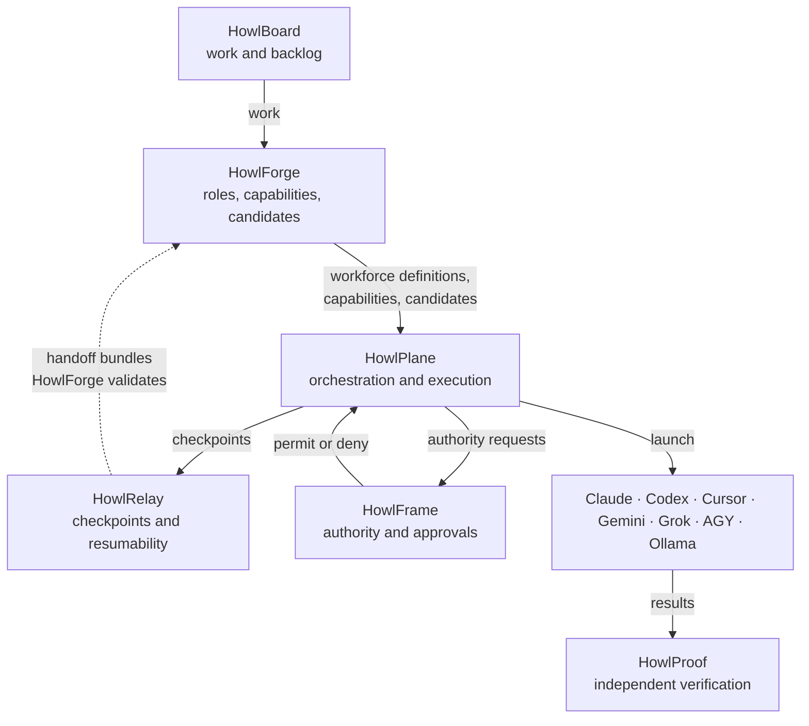

# HowlForge

**The AI workforce definition and runtime selection layer for HowlFutureWorks.**

**Documentation site:** https://howlcipher.github.io/howlforge/

> Roles are durable. Models are replaceable. Sessions are disposable.

HowlForge answers four questions and nothing else:

1. What roles exist, and what capabilities does each one require?
2. Which runtimes are declared, and what is each one's availability right now?
3. Given a role and the current state, which workers are eligible, in what
   order, and **why**?
4. If a worker disappears mid task, what evidence must exist for another worker
   to safely resume?

An architect is a role. Claude Opus is a runtime. The two are never equated,
because the day the model changes, the role has to survive it.

## What HowlForge is not

This matters more than the feature list. HowlForge is **not**:

- an orchestrator. It selects and explains; it never launches a worker.
  That is HowlPlane.
- a checkpoint transport. It defines and validates the handoff contract; it
  does not move checkpoints around. That is HowlRelay.
- an authority system. It reports what a worker *can* do; it never decides what
  a worker *may* do. That is HowlFrame.
- a verifier. It records what verification a role requires; it never runs
  verification. That is HowlProof.
- a scheduler, a queue, a database, a service or a web UI.

HowlForge v1 is a Go library and a CLI. It starts exactly one subprocess, `git`,
and only to answer resume safety questions. A runtime definition can never cause
anything to be executed.

## Where it sits



## Quick start

```bash
git clone https://github.com/howlcipher/howlforge
cd howlforge
make build

./build/howlforge --config config validate
./build/howlforge --config config roles
./build/howlforge --config config match foreman
```

Everything below uses the shipped example configuration in `config/`. It is
marked as an example throughout and is meant to be replaced.

## A role

Roles are data, not code. `config/roles/foreman.yaml`:

```yaml
schema_version: howlforge.role/v1
id: foreman
description: Coordinates complex work and delegates to specialist workers.
responsibilities:
  - decompose_work
  - delegate
  - inspect_results
  - recover_failures
  - synthesize_outputs
  - request_verification
required_capabilities:
  reasoning: very_high
  tool_use: very_high
  long_horizon: very_high
  coding: medium
  context_window: high
preferred_runtimes:
  - provider: openai
    model: gpt-5.6-sol
fallback_runtimes:
  - provider: anthropic
    model: opus
  - provider: google
    model: gemini-flash
handoff_required: true
verification_required: true
verification:
  required: true
  verifier_role: reviewer
  independent_runtime: preferred
```

Note what the role does **not** say: it never names a runtime id. It names a
provider and a model, so any client that reaches that model is a candidate.

## A runtime

`config/runtimes/cursor-sol.yaml`:

```yaml
schema_version: howlforge.runtime/v1
id: cursor-sol
description: GPT-5.6 Sol reached through the Cursor agent.
provider: openai
model: gpt-5.6-sol
runtime: cursor
economic_class: subscription
locality: remote
state:
  enabled: true
capabilities:
  reasoning: very_high
  coding: very_high
  tool_use: very_high
  long_horizon: very_high
  context_window: high
  speed: high
  cost_efficiency: medium
```

The four identity fields are distinct on purpose. `codex-cli-sol` declares the
same provider and model through a different client, and it is a different
runtime with different declared tool use.

**The capability levels are operator expectations, not benchmark results.** They
are the starting point for HowlFutureWorks and are meant to be edited.

## Matching

```console
$ howlforge match foreman
Role: foreman

  #  RUNTIME           CANDIDATE             STATE    PREFERENCE
  1  cursor-sol        cursor / gpt-5.6-sol  UNKNOWN  preferred #1
  2  claude-code-opus  claude-code / opus    UNKNOWN  fallback #2
  3  agy-gemini-flash  agy / gemini-flash    UNKNOWN  fallback #3
```

Every state reads `UNKNOWN` on a fresh install, because nothing has written an
availability file yet. `UNKNOWN` is usable: a runtime nobody has reported on is
not thereby broken, and treating silence as failure would let a missing file
disable the whole workforce. It simply ranks below a confirmed `AVAILABLE`.

Note that `codex-cli-sol` is missing even though it declares the same provider
and model as `cursor-sol`. It declares `tool_use: high`, and the foreman role
requires `very_high`. Same model, different client, different answer.

Selection is deterministic: the same role, runtimes, state and request always
produce the same ordering, byte for byte.

Every decision is explainable, including the rejections:

```console
$ howlforge explain foreman cursor-composer
Role: foreman
Required:
  coding          medium
  context_window  high
  long_horizon    very_high
  reasoning       very_high
  tool_use        very_high
Candidate:
  cursor-composer  (cursor / composer)
Matched:
  coding          very_high  ok
  context_window  medium     SHORT
  long_horizon    high       SHORT
  reasoning       high       SHORT
  tool_use        high       SHORT
Preference:
  eligible but not named by the role
State:
  UNKNOWN

Eligible: no
Rejected: cursor-composer
Reason:
  context_window required high, candidate capability medium
  stage capability, code MISSING_REQUIRED_CAPABILITY
```

Soft preferences reorder the eligible set without changing who is eligible:

```bash
howlforge match implementer --require coding=high
howlforge match architect --prefer quality
howlforge match implementer --prefer cost
howlforge match researcher --prefer local
```

## When a session runs out

This is the case HowlForge exists for. HowlPlane writes what it observes into
an availability state file; HowlForge only reads it.

```console
$ howlforge --state examples/state/availability.json availability foreman
Role: foreman

  RUNTIME           CANDIDATE             STATE          NOTE
  claude-code-opus  claude-code / opus    AVAILABLE      candidate #1
  agy-gemini-flash  agy / gemini-flash    AVAILABLE      candidate #2
  cursor-sol        cursor / gpt-5.6-sol  SESSION_LIMIT  eligible after reset at 2026-09-22T18:00:00Z

recommended runtime: claude-code-opus
reason: preferred runtime currently unavailable; claude-code / opus is the next eligible runtime
```

Three things are worth noticing:

- The limited runtime is still listed. "Comes back at 18:00Z" and "needs an
  operator" are different answers, and HowlPlane needs to tell them apart.
- `cursor-composer` is **not** listed even though it is available, because it
  cannot fill this role. Unavailable and unqualified are different.
- After the reset passes, `cursor-sol` reclaims first place with no
  configuration change.

The departing worker leaves a handoff bundle, and the replacement checks it:

```console
$ howlforge resume check examples/handoffs/HOWL-0042 --repo .
Handoff: /home/user/howlforge/examples/handoffs/HOWL-0042
Task: HOWL-0042  role implementer  cursor / composer

  CHECK                      STATUS    DETAIL
  bundle_valid               pass      all required artifacts present and well formed
  status                     pass      checkpoint status is partial
  safe_to_resume             pass      checkpoint sets safe_to_resume to true
  remaining_explicit         pass      2 remaining item(s) recorded
  unresolved_questions       pass      none recorded
  decisions                  advisory  2 decision(s) recorded, 1 marked irreversible
  verification_evidence      pass      2 recorded check(s), none failed
  verification_reproduced    advisory  not attempted: HowlProof owns verification execution, HowlForge only reads the evidence
  verification_independence  advisory  recorded verification was not independent of the producing worker
  commit_exists              pass      commit 5549653fda43 is present
  head_related               pass      HEAD 6340572d94c3 is a descendant of the recorded commit
  worktree_understood        pass      the working tree is clean as the checkpoint records

SAFE
task HOWL-0042 may be resumed by a replacement worker in role implementer
```

Anything HowlForge cannot establish degrades the verdict to
`NEEDS_RECONCILIATION`. Nothing degrades it to `SAFE`. A working example lives
in `examples/handoffs/HOWL-0042`; run the command above against it.

## Using it as a library

HowlPlane consumes HowlForge directly. The public surface is three interfaces
and no way to launch anything:

```go
forge, err := howlforge.Load(howlforge.Options{Root: "config"})
if err != nil {
    return err
}

candidates, err := forge.Match(ctx, howlforge.MatchRequest{
    Role:    "implementer",
    Require: howlforge.CapabilitySet{"coding": howlforge.LevelHigh},
    Exclude: []string{"cursor-sol"}, // the worker we just lost
})
```

See `docs/INTEGRATION.md` for the full HowlPlane contract.

## Commands

| Command | Purpose |
| --- | --- |
| `howlforge roles` | list every defined role |
| `howlforge role show <role>` | show one role in full |
| `howlforge runtimes` | list every configured runtime |
| `howlforge runtime show <runtime>` | show one runtime and which roles it can fill |
| `howlforge personas` / `persona show <id>` | list personas, resolve one to its role |
| `howlforge capabilities` | show the admitted capability vocabulary |
| `howlforge match <role>` | eligible runtimes in preference order |
| `howlforge explain <role> <runtime>` | account for one pairing |
| `howlforge availability [role]` | who can work right now, and when the rest return |
| `howlforge handoff validate <dir>` | check a bundle against the contract |
| `howlforge handoff inspect <dir>` | summarize a bundle |
| `howlforge resume check <dir>` | decide whether it is safe to continue |
| `howlforge validate` | check the whole configuration |
| `howlforge doctor` | report the effective environment |

Every command takes `--json`. Exit codes are documented in `docs/CLI.md`.

## Documentation

| Document | Contents |
| --- | --- |
| [`ARCHITECTURE.md`](ARCHITECTURE.md) | identity model, deterministic matching, state transitions, every component boundary |
| [`docs/CLI.md`](docs/CLI.md) | every command, flag and exit code |
| [`docs/HANDOFF.md`](docs/HANDOFF.md) | the handoff contract and resume rules in full |
| [`docs/INTEGRATION.md`](docs/INTEGRATION.md) | how HowlPlane, HowlRelay, HowlFrame and HowlProof interact with HowlForge |
| [`docs/SCHEMA_MAPPING.md`](docs/SCHEMA_MAPPING.md) | how HowlForge's vocabularies map onto HowlPlane's existing ones |
| [`schemas/README.md`](schemas/README.md) | the JSON Schema definitions |
| [`AGENTS.md`](AGENTS.md) | rules for AI agents working in this repository |
| [`CONTRIBUTING.md`](CONTRIBUTING.md) | how to make a change |

## Building

```bash
make build     # compile to build/howlforge
make test      # run the suite
make verify    # format check, vet, tests and configuration validation
make help      # list every target
```

Requires Go 1.24 or newer and nothing else.

## License

MIT. See [`LICENSE`](LICENSE).
