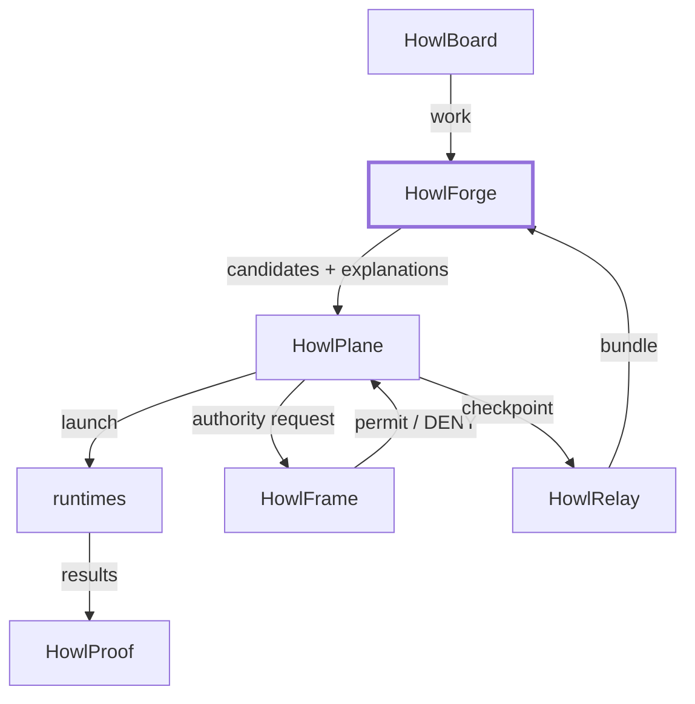

# Integration contract

How the rest of HowlFutureWorks talks to HowlForge, and where each boundary sits.

## HowlPlane

### The conversation

```
HowlPlane:  I need an implementer with high coding ability.
HowlForge:  Here are the eligible candidates in preference order,
            with the reason each one is where it is.
HowlPlane:  Launch candidate #1.
runtime:    SESSION_LIMIT
HowlRelay:  Checkpoint captured.
HowlPlane:  Forge, rematch this role excluding the worker I just lost.
HowlForge:  Candidate #2 is available, and #1 returns at 18:00Z.
HowlPlane:  Resume via candidate #2.
```

HowlForge speaks only in the second and last turns. It never launches, never
retries, never decides to wait.

### In code

```go
forge, err := howlforge.Load(howlforge.Options{
    Root:      "config",
    StatePath: "/var/lib/howlplane/availability.json",
})
if err != nil {
    return err
}

// First ask.
candidates, err := forge.Match(ctx, howlforge.MatchRequest{
    Role:    "implementer",
    Require: howlforge.CapabilitySet{"coding": howlforge.LevelHigh},
})

// ... HowlPlane launches candidates[0], which hits a session limit,
// and writes SESSION_LIMIT into the state file.

// Rematch, excluding the worker just lost.
forge, err = howlforge.Load(howlforge.Options{ /* same options */ })
candidates, err = forge.Match(ctx, howlforge.MatchRequest{
    Role:    "implementer",
    Require: howlforge.CapabilitySet{"coding": howlforge.LevelHigh},
    Exclude: []string{"cursor-sol"},
})
```

`Load` re-reads the state file, which is how HowlPlane's own observation reaches
the next match. A `Forge` is an immutable snapshot; reload to pick up new state.

### The public surface

Three interfaces, and none of them can cause execution:

```go
type Matcher interface {
    Match(ctx context.Context, req MatchRequest) ([]Candidate, error)
}

type Explainer interface {
    Explain(ctx context.Context, req MatchRequest, runtimeID string) (*Explanation, error)
}

type Validator interface {
    Validate(ctx context.Context) (*ValidationReport, error)
}
```

`MatchResult` (from `forge.MatchResult`) additionally carries every rejection
with its stage and reason, which is what HowlPlane should log when it explains a
routing decision after the fact.

### Or through the CLI

For a HowlPlane that does not want a Go dependency, every answer is available as
schema stamped JSON with useful exit codes:

```bash
howlforge match implementer --require coding=high --json
# exit 4 means no eligible candidate
```

### What HowlPlane owns and HowlForge must never do

| HowlPlane | HowlForge |
| --- | --- |
| launching workers | listing who is eligible |
| retry and backoff policy | saying whether a state is transient |
| deciding to wait for a reset | reporting when the reset is |
| observing and writing availability | reading availability |
| task lifecycle state | role and capability definitions |

### The honest overlap

HowlPlane's `src/control_plane/synthesis/provider_pool.py` already implements a
nine stage eligibility filter with durable capacity state and deterministic
ranking. HowlForge is meant to be the definition layer that pool adopts, not a
second selector running beside it.

Adoption should be a translation, not a rewrite, which is why
[`SCHEMA_MAPPING.md`](SCHEMA_MAPPING.md) maps the vocabularies directly. Running
both selectors against different role definitions would be worse than running
either alone.

## HowlRelay

HowlRelay moves and stores checkpoints. HowlForge defines and validates their
shape and never writes or transports one.

```
worker approaching a limit
    -> writes .ai/handoffs/<TASK>/
    -> HowlRelay captures and stores it
    -> HowlForge validates it:      howlforge handoff validate <dir>
    -> HowlForge judges resumption: howlforge resume check <dir> --repo <dir>
    -> HowlPlane acts on the verdict
```

The contract is in [`HANDOFF.md`](HANDOFF.md) and the schemas are in
[`../schemas/`](../schemas/). HowlRelay can validate against the JSON Schema
files without linking the Go packages.

Note the unresolved ownership question, stated rather than hidden: HowlPlane's
own site assigns "durable trajectory journals and resumable handoff packages" to
HowlRelay, while HowlPlane's tree defines `ai.handoff/v1` in `schemas/`. Three
components have a claim on handoff artifacts. HowlForge does not settle that; it
documents the mapping so whoever settles it has the facts.

## HowlFrame

**Capability is not authority.** This is the most important boundary in the
system, because confusing the two would let a declared aptitude become a granted
permission.

```
Role: implementer
requested capability:
    repository_write
HowlForge:
    worker supports repository_write
HowlFrame:
    DENY
```

HowlForge reports what a worker *can* do. HowlFrame decides what it *may* do,
and HowlFrame's answer is final. HowlForge has no way to appeal it, override it,
or even observe it.

The two vocabularies are kept structurally separate so no code path can confuse
them:

| Vocabulary | Values | Owner |
| --- | --- | --- |
| Aptitude | `reasoning`, `coding`, `tool_use`, `long_horizon`, … | HowlForge |
| Authority | `filesystem:repository`, `git:push`, `network:allowlist`, … | HowlFrame |

A runtime declaring `coding: very_high` says nothing about repository access. A
role declaring `coding: very_high` is not requesting repository access. If
HowlForge ever needs to express an authority requirement, it should carry
HowlFrame's vocabulary verbatim rather than inventing a parallel one.

## HowlProof

Workers must not self certify. HowlForge encodes the requirement; HowlProof
executes verification.

```yaml
verification:
  required: true
  verifier_role: reviewer
  independent_runtime: required
```

| Field | Meaning |
| --- | --- |
| `required` | work by this role must be verified by someone else |
| `verifier_role` | which role must do it. Must exist, and must not be this role. |
| `independent_runtime` | `required` means the verifying runtime must differ from the producing one; `preferred` means it should where an alternative exists; `none` means no constraint |

`howlforge validate` enforces that `verifier_role` exists and is not the role
itself, so `implementer != final verifier` is a configuration error rather than
a convention.

HowlForge's contribution to runtime diversity is that it can answer "who else
could do this" through `Match` with `--exclude` set to the producing runtime:

```bash
howlforge match reviewer --exclude cursor-composer --json
```

HowlProof decides whether the verification it obtained is good enough.
`verification.json` records independence truthfully, so a worker that verified
its own output says so rather than the fact being lost.

## HowlBoard

HowlBoard owns work and backlog. HowlForge consumes nothing from it directly in
v1; the `task_id` in a checkpoint is the shared identifier.

## Summary of boundaries



The bolded box is the only one this repository implements. Everything crossing
its edge is a contract, not a call.
